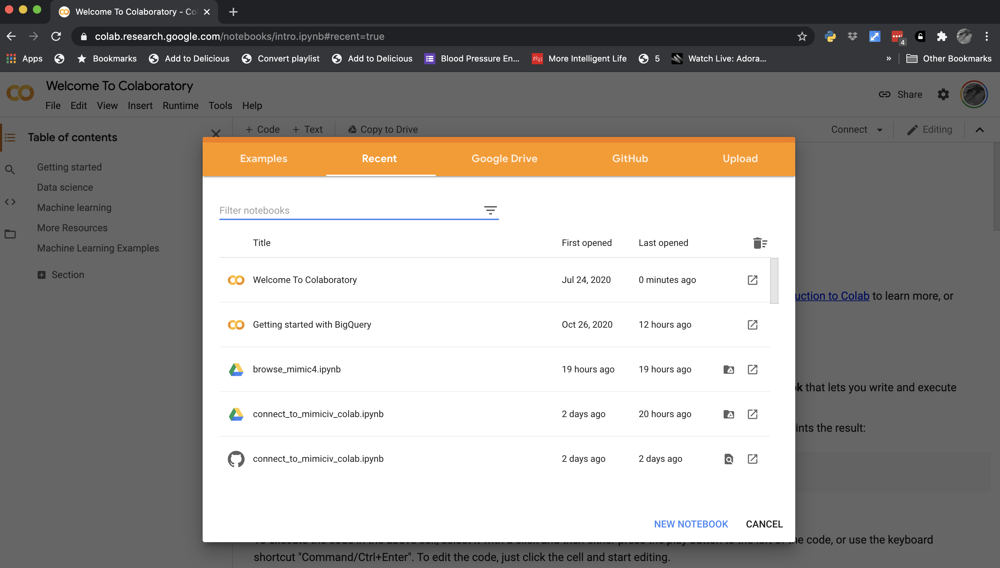
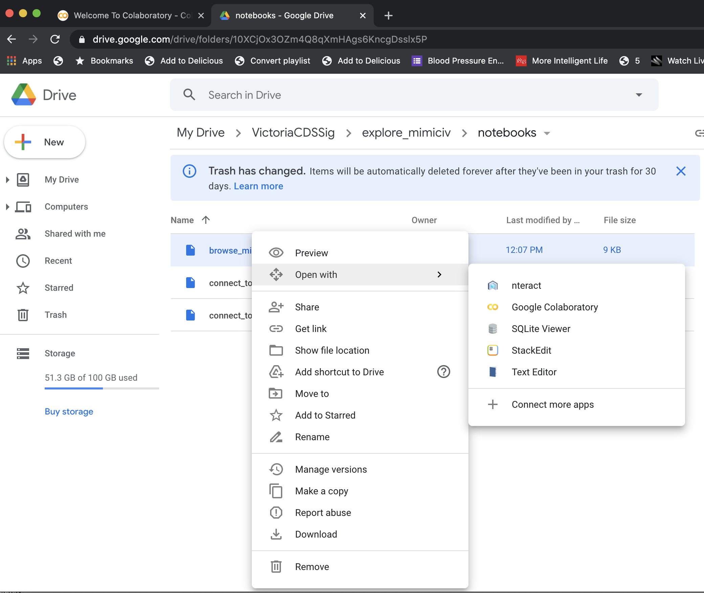

# explore_mimiciv

This repository contains some Jupyter notebooks for exploring MIMIC-IV using Google's BigQuery. This assumes you have already been granted access to MIMIC via Physionet, that you have a Google account, and you have enabled Google Colaboratory with Google Drive.

Two approaches:

- Go straight to https://colab.research.google.com/. You should be greeted by a web page looking something like this:

This allows you to import the notebook directly from GitHub, Google Drive, or your computer.

- Clone the repository to your Google Drive on your computer and the go to https://drive.google.com/. Navigate to the directory where you have cloned the repository and you should be able to see the the notebooks. If you have enabled Colaboratory with Google Drive, you should be able to right click on the notebook and open it in Colaboratory.

## Caveats

These are unpolished notebooks. Probalby the best starting point for the novice is `browse_mimic4.ipynb`. This defines a class that allows you to select which database you want to explore and then which table within the database. The visualizations are done via Seaborn, which isn't great for large number of numeric values. I'm using Ibis to query BigQuery, which defaults to limit the number of returned rows to no more than 10k. I've left this in place for now.

`connect_to_mimiciv_colab.ipynb` is similar except it assumes you've already created a Pandas DataFrame by querying a specific table in a database.

`connect_to_mimiciv_bq.ipynb` does not use Colaboratory but instead runs from your computer and assumes you have already created and downloaded a secret from Google.

I'll poset a video of how to use them later. Improvements and feedback are welcome.
